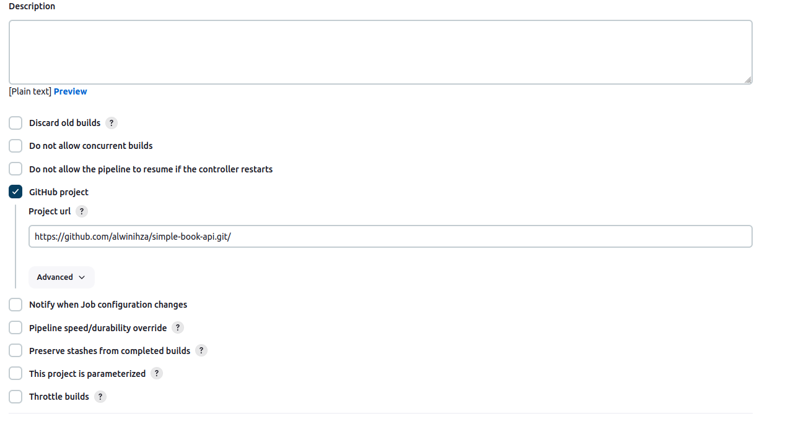

# simple-book-api

# Build Local
## Build with Docker
- Build Docker
```sh
docker build -t simple-golang .
```
- Run the docker
```sh
docker run --name livecode-golang-alwin -p <API PORT>:8000 -e DB_HOST=<DB HOST> -e DB_PORT=<DB_PORT> -e DB_NAME=<DB_NAME> -e DB_USER=<DB_USER> -e DB_PASSWORD=DB_PASSWORD -d simple-golang
```
This will expose API to <API PORT> 
## Build with docker compose
- Run docker compose
```sh
DB_HOST=${DB_HOST} DB_PORT=${DB_PORT} DB_NAME=${DB_NAME} DB_USER=${DB_USER} DB_PASSWORD=${DB_PASSWORD} API_PORT=${API_PORT} ${DOCKER_APP} compose up -d
```

# INTEGRATION STEPS
1. Create golang project (you can see in main.go)
2. Create Dockerfile
3. Test Dockerfile Run


4. Create docker-compose.yml
5. Test docker-compose.yml


6. Create Jenkinsfile
7. Create github
8. Configure webhook


9. Configure Jenkins' Job with Pipeline Configuration




# Result
## Local Run
### Local Screenshot


## Server Run
### Server Screenshot


## Notification
### EMail Notif


### Slack NOtif

